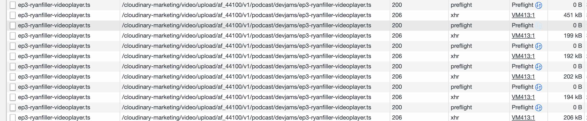

# "Drinking Our Own Champagne" 
## With Cloudinary Video Player

[Code Repo](https://github.com/cloudinary-training/podcasts)

[Podcast Website](https://cloudinary.com/podcasts)

This is a story about using your company's product because a) it helps you solve an internal business problem and b) you like it! 

"Drinking Our Own Champagne" refers to our use of the Cloudinary Video Player to serve videos created by the training organization. Using your company's software in-house was made famous by Microsoft's use of the term ["Eating your own dog food"](https://en.wikipedia.org/wiki/Eating_your_own_dog_food). Microsoft used this term because they were asking employees to use alpha and beta versions of their products. In this story, we are using production Video Player code.

## Podcasts

A cross functional team including employees from Customer Training and Marketing are working on an initiative that involves releasing video podcasts weekly. The subject matter is split between two podcast brands: **Dev Jams** and **MX Matters**. **Dev Jams** is an opportunity for us to showcase projects created by our customer, and to get to know them better. **MX Matters** provides a platform to share information about our evolving product line from our Product team.

The video podcasts are about an hour in length. We provide access to this content through YouTube, Spotify, Apple, ... <not sure all>. We also host a web page through the [cloudinary.com](https://www.cloudinary.com/podcasts) website that allows users to view the video. Because the videos are longer than 1 minute, and we want to prevent buffering, we are using a feature of the Cloudinary Video Player called Adaptive Bitrate Streaming (ABS).

### Creating a Good User Experience with the Podcasts

Since we have a web page on the cloudinary.com website devoted to podcasts, we want to make the User Experience as delightful as possible. We address this on 2 fronts:

1. Video streaming using Adaptive Bitrate Streaming (ABS) to achieve low latency and no buffering

2. Video collections presented as a grid with modal popup for easy full screen viewing

## What is ABS ?

Adaptive Bitrate Streaming is a technique for streaming video that can be run in the application layer of the internet: HTTP. Essentially the video server "chunks" up the video and the client browser reads in chunks using AJAX. It works by detecting a users bandwidth on the client side, and then adjusting the quality of the streaming accordingly. If the client's network supports a heavier load, the size of the chunks and the quality of the video will be greater. For a client with a lower bandwidth network, the chunks can be made smaller. The net result is that when the viewer clicks on the Video Player start control, video is immediately streamed.

Not only does the Cloudinary Video Player help with ABS, but Cloudinary can create the "chunks" on the server so that they are all available when needed.

There are several implementations of ABS, such as Dynamic Adaptive Streaming Over HTTP (MPEG-DASH) and Apple's HTTP Live Streaming (HLS). The different implementations use different algorithms to provide that highest bitrate possible, given the network in which streaming is occurring.

Browsers support video containers, such as `mp4`. Containers are often referred to as formats. Containers use codecs, which are algorithms for compression. The `H.264` codec is considered Universal as it is used in many containers and therefore usable in many browsers and devices. Learn more about containers and codecs [here](https://developer.mozilla.org/en-US/docs/Web/Media/Formats/codecs_parameter).

HLS requires a manifest, which is basically a list that points to a set of chunked files. The HLS manifest has an extension of `m3u8` and a sample is shown below. You can see that it is a listing of `ts` files that contain the video chunks. While `ts` and `m3u8` are not natively supported in all browsers, the Cloudinary Video Player makes it possible to use HLS with `H.264`.

```bash
#EXTM3U
#EXT-X-VERSION:4
#EXT-X-TARGETDURATION:4
#EXT-X-MEDIA-SEQUENCE:0
#EXT-X-PLAYLIST-TYPE:VOD
#EXTINF:3.960000,
#EXT-X-BYTERANGE:177096@0
ep3-ryanfiller-videoplayer.ts
#EXTINF:3.960000,
#EXT-X-BYTERANGE:450260@177096
ep3-ryanfiller-videoplayer.ts
#EXTINF:3.960000,
#EXT-X-BYTERANGE:198904@627356
ep3-ryanfiller-videoplayer.ts
#EXTINF:3.960000,
#EXT-X-BYTERANGE:191572@826260
ep3-ryanfiller-videoplayer.ts
#EXTINF:3.960000,
#EXT-X-BYTERANGE:202100@1017832
ep3-ryanfiller-videoplayer.ts
#EXTINF:3.960000,
#EXT-X-BYTERANGE:193452@1219932
ep3-ryanfiller-videoplayer.ts
#EXTINF:3.960000,
#EXT-X-BYTERANGE:205860@1413384
ep3-ryanfiller-videoplayer.ts
#EXTINF:3.960000,
#EXT-X-BYTERANGE:207364@1619244

```

If you inspect your browser's network tab you'll see a lot of `.ts` files being loaded and even pre-loaded.



If you look closely at the path of these files, and you're familiar with Cloudinary URL's, you'll notice these are files served from Cloudinary. They have 2 transformations. The first is for an audio frequency that guarantees a moving mouth matches the audio what the listener hears: `af_441000`. The second provides a file format of `ts`, so that the file can be fetched into the browser based on the HLS manifest. These are actually both transformations created eagerly and explicitly from the original `mp4` file uploaded to Cloudinary. Eager transformations are those that are created asynchronously and Explicit transformation are those that are created after the upload of the asset is complete. We'll look at the workflow for this next.

```bash
/cloudinary-marketing/video/upload/af_44100/v1/podcast/devjams/ep3-ryanfiller-videoplayer.ts
```

## Workflow

Creating, editing, uploading and transforming the videos for the podcasts are handled by Customer Training. After that, there is a handoff to Marketing to have them published on the Podcast website. Marketing works with an Agency to code and build the website pages. The image below describes this workflow.


By modularizing this workflow, we are able to let different people work on different aspects of the final product. The five step process is described below.

1. The video is recorded using [Zoom Record](https://support.zoom.us/hc/en-us/sections/200208179-Recording).
1. Next, the video is processed by [Descript](https://www.descript.com/), a tool that aids in cleaning up and transcribing the language used.
1. The video is then enhanced with visuals in a post processing phase. Once the video is ready it is uploaded as an `mp4` to Cloudinary.
1. Once the video is in Cloudinary, a script can be run to create the transformations (chunking and audio syncing) that prepares the video for streaming to the Video Player.
1. After the derived video files have been created, the public id is handed off to the web developers at the A[Moonstone Interactive](https://www.msinteractive.com/) that works on the website.

We'll look at the code used to create the derived video chunks and the code used to render the video player in the next sections.

## Script to Create Derived Video for Use with ABS

The script shown below is used to create derived assets that can be requested by the Video Player to enable Adaptive Bitrate Streaming.

The code is set up as a function that accepts the Cloudinary public ID for the original video that was uploaded.

The function specifies an `eager` transformation. As mentioned earlier, `eager` transformations are those that can be applied to assets that are already uploaded, as opposed to on-the-fly transformations that are applied to the original uploaded asset. Eager transformations can be synchronous or asynchronous. Processing an hour long video takes time and many derived videos files are created, so it makes sense for this to be asynchronous. In order to be notified that the entire process is complete, the `eager_notification_url` key is set with a website that can capture and report such notifications. [webhook.site](https://webhook.site) is a website that can capture and report such notifications and it's free to use.

This code uses the [Cloudinary Node.js SDK](https://cloudinary.com/documentation/node_integration). The Node SDK function, `cloudinary.uploader.explicit`, calls upon the [Upload API explicit method ](https://cloudinary.com/documentation/image_upload_api_reference#explicit_method) to act on a previously uploaded Video with the public ID provided as a parameter to the `explictHDProfile` function.

The options specify that the asset is a video. The `eager` key provides an array of transformations. The first transformation is a [`streaming_profile`](https://cloudinary.com/documentation/admin_api#adaptive_streaming_profiles), which is a collection of transformations that can be used to create ABS transformations per the quality indicated (`hd`) and the format (`m3u8`).  
We also provide transformations for `audio_frequency` of `44100`. This helps the audio to match the speaker's lip movement.

The `type` of `upload` is the default and makes the video assets public. The `invalidate` set to `true` indicates that previously cached versions, if there are any, of these derived files should be invalidated so that they can be replaced.

```JavaScript
require("dotenv").config();
const cloudinary = require("cloudinary").v2;

function explictHDProfile(publicId) {
  const options = {
    resource_type: "video",
    eager: [
      { streaming_profile: "hd", format: "m3u8" },
      {
        format: "mp4",
        transformation: [{ audio_frequency: 44100 }],
      },
      {
        format: "mp4",
        transformation: [{ audio_frequency: 44100 }, { video_codec: "h264" }],
      },
      {
        format: "m3u8",
        transformation: [{ audio_frequency: 44100 }],
      },
    ],
    eager_async: true,
    eager_notification_url:
      "https://webhook.site/",
    type: "upload",
    invalidate: true,
  };
  cloudinary.uploader.explicit(publicId, options, function (error, result) {
    if (error) console.log("error", error);
    else console.log(result);
  });
}

```

## Web Page Uses Fancybox

The cloudinary.com website uses a jQuery library, [Fancybox](http://fancybox.net/) that provides [lightbox](<https://en.wikipedia.org/wiki/Lightbox_(JavaScript)>) functionality.

The frontend developer, Sean Massa, who worked on this characterized the requirements and solution breakdown like this:

“The challenge for this project was to build a single modal and video player in which the content would dynamically change based on the thumbnail clicked.
There were many approaches that seemed to work when we were dealing with just a single video implementation, but when it came to reloading the player with a new video on the fly we ran into a few walls along the way, and had to step back and rethink our approach.
The result was to setup an instance of the player including all parameters and transformations done explicitly through JavaScript, as adding a mix of JS and inline to the player created issues. We then used data attributes to set the poster and source on click of the desired item, the poster also had to be set before the video source or it would not work."

As is made clear in the final code for the front end, the goal of creating multiple modal video players on a single page, was achieved by rendering a single video tag in the Fancybox popup, and then attaching Cloudinary Video Player code and options to this single video tag when the user clicked on a specific video link.

You can view the stripped down implementation of the solution in the demo linked to in this blog.

### HTML

You can see that classes have been added to this video tag that are interpreted by the Cloudinary Video Player, such as `cld-fluid`, which will allow the video player to fill its container.  The `video` tag is located in a single `div` that is rendered but not displayed. It is id'd as `sample-video-id` and this will be used by Cloudinary Video Player to locate the tag. You'll find the tag rendered in your inspector tool, but you won't see it on the web page, until a fancy box link has been clicked.  

```html
<div id="video-wrapper" style="display: none">
  <video
    id="sample-video-id"
    class="cloudinary-video cld-video-player cld-video-player-skin-dark cld-fluid controls"
    controls
  ></video>
</div>
```

The Cloudinary Video Player code can be accessed using [NPM](npmjs.org), and incorporated into JavaScript Frameworks.  For the podcast web page, we're using jQuery and fetching all external libraries via CDN.

```html
<script
      src="https://code.jquery.com/jquery-3.6.0.slim.min.js"
      integrity="sha256-u7e5khyithlIdTpu22PHhENmPcRdFiHRjhAuHcs05RI="
      crossorigin="anonymous"
    ></script>
    <script src="https://cdn.jsdelivr.net/npm/jquery@3.5.1/dist/jquery.min.js"></script>
    <link
      rel="stylesheet"
      href="https://cdn.jsdelivr.net/gh/fancyapps/fancybox@3.5.7/dist/jquery.fancybox.min.css"
    />
    <script src="https://cdn.jsdelivr.net/gh/fancyapps/fancybox@3.5.7/dist/jquery.fancybox.min.js"></script>
    <link
      href="https://unpkg.com/cloudinary-video-player@1.5.1/dist/cld-video-player.min.css"
      rel="stylesheet"
    />
    <script
      src="https://unpkg.com/cloudinary-core@latest/cloudinary-core-shrinkwrap.min.js"
      type="text/javascript"
    ></script>
    <script
      src="https://unpkg.com/cloudinary-video-player@1.5.1/dist/cld-video-player.min.js"
      type="text/javascript"
    ></script>
```

### Clickable Link for Each Video

Each video that we want to open with the Video Player in the modal is set up with data that provides the Cloudinary public id.  The Cloudinary Video Player can create a poster from a midpoint frame of the video itself.  For the podcast we provide a link to an image on Cloudinary.  The public id and poster link are the only data handed off to the JavaScript that opens the video player.  Notice that there is a `video-trigger` class. This will be used to attach a click event.  The `data-video-id` contains the Cloudinary public id. The `data-video-poster` contains a link to an optimized image on Cloudinary.  The `href` links to the hidden video tag.


```html
<div>
  <a
    class="fancybox video-trigger"
    href="#video-wrapper"
    data-video-id="climbing"
    data-video-poster="https://cloudinary-res.cloudinary.com/images/c_scale,w_auto,dpr_auto/f_auto,q_auto/v1614262961/Featured_Podcast/Featured_Podcast.png"
  >
    Watch climbing here
  </a>
</div>
```

The JavaScript shown below calls the `fancybox()` function which takes as input all the HTML, JavaScript, and CSS that the Video Player function attaches to the `video` tag.  In order to call the `videoPlayer` function, we need to provide the video tag selector, `sample-video-id`.  We also add a set of options that will instruct the video player to use the `hd` streaming profile and the audio transformation.  The playback rates allow the user to control the speeds at which they stream the video.  

Finally we provide a `click` event handler with jQuery.  When the user clicks we pull the public id and the poster data out of the video link and then call the Video Player `source` function to activate the video player.

```javascript
jQuery(document).ready(function () {
  jQuery('.fancybox').fancybox();
  // Initialize player
  var cloudinaryCld = cloudinary.Cloudinary.new({ cloud_name: 'CLOUD_NAME' });
  var options = {
    sourceTypes: ["hls", "mp4"],
    bigPlayButton: "init",
    muted: true,
    transformation: {
      streaming_profile: "hd",
    },
    sourceTransformation: {
      hls: {audio_frequency: 44100}
    },
    playbackRates: [0.5, 1, 1.5, 2]
  }
  var media = cloudinaryCld.videoPlayer('sample-video-id', options);
  jQuery(document).on("click", ".fancybox.video-trigger", function () {
    var videoID = jQuery(this).data('video-id');
    var videoPoster = jQuery(this).data('video-poster');
    media.posterOptions({publicId: videoPoster})
    media.source({ publicId: videoID});
  });
});
```

### Note: max-width

Page styling is very important in setting up this "multi video player" web page.  The sample code uses limited styling.  An important point is to be careful with setting `max-width` on the `video` tag or `video-wrapper` as this can interfere with full screen functionality.


## Summary

There is always a next step in web page development, but it's nice to reach a milestone where you can feel confident about a workflow and then focus on the contents of the work.  As more websites embrace video content, we look forward to learning and sharing techniques that enhance the User Experience.  We're alway looking for way to drink the Champagne!
